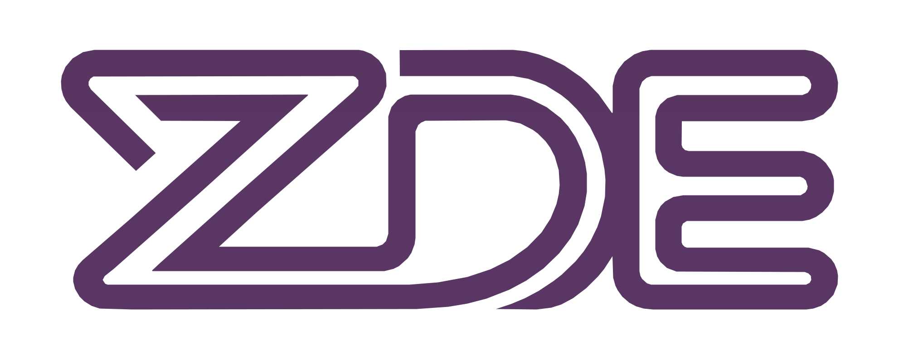

# Zeal Development Environment

[](https://www.apache.org/licenses/LICENSE-2.0)

Zeal Development Environment (ZDE) is the build and tooling environment for working on software for the [Zeal 8-bit Computer](https://zeal8bit.com/). It provides a consistent containerized toolchain, project scaffolding, dependency management, image staging utilities, and optional host-mode activation.

Start with the [Getting Started Guide](./docs/getting-started/README.md), or use the [ZDE command reference](./docs/README.md) for detailed command documentation.

## Table of Contents

- [What ZDE Provides](#what-zde-provides)
- [Getting Started](#getting-started)
- [Quick Command Overview](#quick-command-overview)
- [Requirements And Dependencies](#requirements-and-dependencies)
- [Upgrading from a Previous Version](#upgrading-from-a-previous-version)

## What ZDE Provides

- A container-based development environment for Zeal projects.
- A host wrapper script (`./zde`) for launching builds, tools, and long-lived services.
- Optional host-mode activation for running against the ZDE-managed toolchain without entering the container.
- Project templates for quickly starting new Zeal applications.
- Dependency management for required and optional tool repositories.

## Getting Started

The [Getting Started Guide](./docs/getting-started/README.md) is the canonical installation and first-project walkthrough. It covers Linux, macOS, Windows with WSL2, language selection, project creation, builds, emulation, and physical hardware deployment.

Use [Shell Environment Setup](./docs/env.md) for `ZDE_PATH`, `PATH`, VS Code integration, host-mode activation, and optional environment overrides.

## Quick Command Overview

Use `zde COMMAND [args]`.

Host wrapper and service commands:

- `zde -v` / `zde --version`: print the current ZDE version and configured ZDE image reference.
- [`zde update`](./docs/update.md): update the local ZDE checkout, pull the container image, and run ZDE sync tasks.
- [`zde -i`](./docs/interactive.md): open an interactive shell inside the ZDE container.
- [`zde activate`](./docs/activate.md): emit shell exports for host mode.
- [`zde emulator`](./docs/emulator.md): start, stop, or query the Zeal Web Emulator service.
- [`zde playground`](./docs/playground.md): start, stop, or query the Zeal Playground service.

Core ZDE commands:

- [`zde deps`](./docs/deps.md): manage required and optional dependencies.
- [`zde create`](./docs/create.md): scaffold a new project from a template.
- [`zde make`](./docs/make.md): run `make` in the current project.
- [`zde cmake`](./docs/cmake.md): configure and build CMake projects.
- [`zde image`](./docs/image.md): manage EEPROM, CF, TF, and romdisk staging and image files.
- [`zde config`](./docs/config.md): inspect and change persistent ZDE config.
- [`zde kernel`](./docs/kernel.md): build the Zeal kernel with predefined or user config.
- [`zde tui`](./docs/tui.md): launch the optional terminal UI.
- [`zde test`](./docs/test.md): run ZDE Python unit tests.

For the full command map, runtime configuration, and per-command reference pages, see [docs/README.md](./docs/README.md).

## Requirements And Dependencies

Base requirements:

- `git`
- a supported container runtime: Docker or Podman
- Compose support through the runtime's `compose` subcommand

For Docker, ZDE requires Docker Compose v2 (`docker compose`), usually provided by the
`docker-compose-plugin` package. The legacy standalone `docker-compose` command does not
satisfy this requirement. Verify the installation before running ZDE:

```sh
docker compose version
```

For Podman, verify the equivalent command with `podman compose version`.

ZDE dependency model:

- Required dependencies are installed and synchronized by `zde update`.
- Optional dependencies are installed on demand with `zde deps install <id-or-alias>`.
- Installed dependency state is tracked in `~/.zeal8bit/deps-lock.yml`.
- Generated dependency environment exports are written to `~/.zeal8bit/deps.env`.
- The state directory defaults to `~/.zeal8bit` and can be overridden by setting `ZDE_USER_PATH` in your environment before running `zde`.

Host mode:

- You can activate ZDE without entering the container by running `eval "$(zde activate)"` or sourcing `bin/activate`.
- Host mode assumes you already have the required native tooling available on your machine.

Project-specific prerequisites may still apply depending on which Zeal project, SDK, or optional dependency you are using.

## Upgrading from a Previous Version

If you are on an older ZDE version, run `zde update` twice — the first run pulls the latest ZDE code, and the second applies any updated sync tasks against the new version:

```sh
./zde update
./zde update
```

ZDE will automatically migrate required (core) dependencies. Non-core optional dependencies are no longer tracked as submodules — they can be reinstalled after upgrading with `zde deps install <id-or-alias>`.
